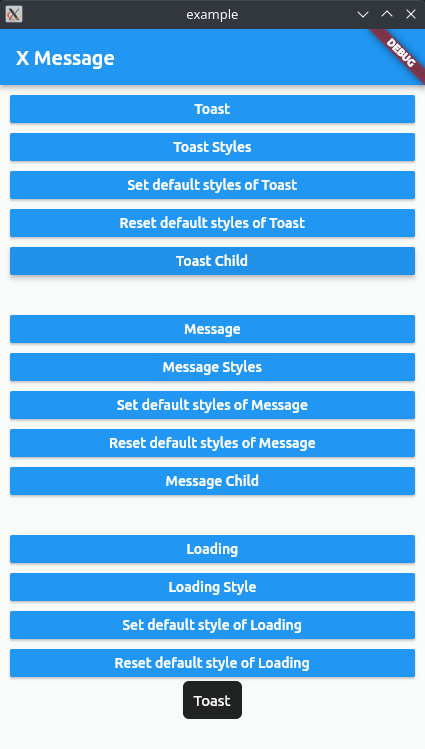
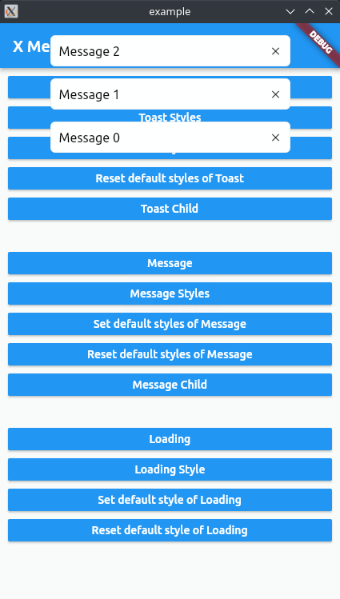
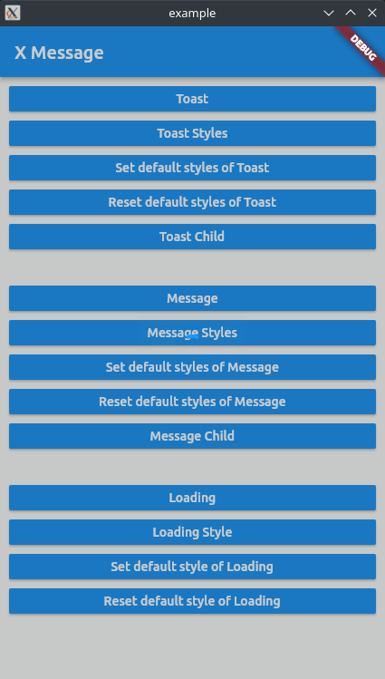

# x_message

Show Toast, Message and Loading in Flutter.







## Installation

```yaml
dependencies:
  x_message: ^0.1.0
```

## Usage

### Import

```dart
import 'package:x_message/x_message.dart';
// Or
import 'package:x_message/src/toast.dart';
import 'package:x_message/src/message.dart';
import 'package:x_message/src/loading.dart';
```

### Basic usage

#### Toast

```dart
Toast(
    context: context,
    message: 'Toast',
);
```

Change the styles of Toast.

```dart
Toast(
    context: context,
    message: 'Toast',
    position: ToastPosition.center,
    padding: const EdgeInsets.all(5),
    fontSize: 16,
    color: Colors.blue,
    backgroundColor: Colors.white,
    border: Border.all(
        color: Colors.blue,
        width: 1,
    ),
    borderRadius: 8,
);
```

Set default styles of Toast.

```dart
Toast.defaultToEdge = 40;
Toast.defaultPosition = ToastPosition.center;
Toast.defaultDuration = const Duration(seconds: 2);
Toast.defaultPadding = const EdgeInsets.all(20);
Toast.defaultFontSize = 16;
Toast.defaultColor = Colors.grey;
Toast.defaultBackgroundColor = Colors.black;
Toast.defaultBorder = Border.all(
    color: Colors.black,
    width: 0.5,
);
Toast.defaultBorderRadius = 7;
```

Reset default styles of Toast.

```dart
// Toast.reset();
Toast.resetDefaultToEdge();
Toast.resetDefaultPosition();
Toast.resetDefaultDuration();
Toast.resetDefaultPadding();
Toast.resetDefaultFontSize();
Toast.resetDefaultColor();
Toast.resetDefaultBackgroundColor();
Toast.resetDefaultBorder();
Toast.resetDefaultBorderRadius();
```

Set your own child of Toast.

```dart
Toast(
    context: context,
    child: const Icon(Icons.ac_unit),
);
```

#### Message

```dart
Message(
    context: context,
    message: 'Message',
);
```

Change the styles of Message.

```dart
Message(
    context: context,
    message: 'Message',
    width: 400,
    spacer: 20,
    duration: const Duration(seconds: 15),
    padding: const EdgeInsets.all(15),
    fontSize: 17,
    textAlign: TextAlign.center,
    overflow: TextOverflow.clip,
    softWrap: true,
    color: Colors.grey,
    backgroundColor: Colors.black,
    border: Border.all(
        color: Colors.black,
        width: 0.5,
    ),
    borderRadius: 7,
    // showClose: false,
    close: const Icon(
        Icons.ac_unit,
        color: Colors.grey,
    ),
);
```

Set default styles of Message.

```dart
Message.defaultWidth = 400;
Message.defaultSpacer = 20;
Message.defaultDuration = const Duration(seconds: 15);
Message.defaultPadding = const EdgeInsets.all(15);
Message.defaultFontSize = 17;
Message.defaultTextAlign = TextAlign.center;
Message.defaultOverFlow = TextOverflow.clip;
Message.defaultSoftWrap = true;
Message.defaultColor = Colors.grey;
Message.defaultBackgroundColor = Colors.black;
Message.defaultBorder = Border.all(
    color: Colors.black,
    width: 0.5,
);
Message.defaultBorderRadius = 7;
// Message.defaultShowClose = false;
Message.defaultClose = const Icon(
    Icons.ac_unit,
    color: Colors.grey,
);
```

Reset default styles of Message.

```dart
// Message.reset();
Message.resetDefaultWidth();
Message.resetDefaultSpacer();
Message.resetDefaultDuration();
Message.resetDefaultPadding();
Message.resetDefaultFontSize();
Message.resetDefaultTextAlign();
Message.resetDefaultOverFlow();
Message.resetDefaultSoftWrap();
Message.resetDefaultColor();
Message.resetDefaultBackgroundColor();
Message.resetDefaultBorder();
Message.resetDefaultBorderRadius();
Message.resetDefaultShowClose();
Message.resetDefaultClose();
```

Set your own child of Message.

```dart
late Message message;
    message = Message(
    context: context,
    child: Row(
        children: [
            const Text('Message'),
            MaterialButton(
                onPressed: () {
                message.remove();
                },
                child: const Text('remove'),
            ),
        ],
    ),
);
```

#### Loading

```dart
final loading = Loading(
    context: context,
);
loading.show();
await Future.delayed(const Duration(seconds: 2));
loading.hide();
```

Change the styles of Loading.

```dart
final loading = Loading(
    context: context,
    child: const Icon(Icons.ac_unit),
    backgroundColor: Colors.black12,
);
loading.show();
await Future.delayed(const Duration(seconds: 2));
loading.hide();
```

Set default styles of Loading.

```dart
Loading.defaultIcon = const Icon(Icons.ac_unit);
Loading.defaultBackgroundColor = Colors.black12;
```

Reset default styles of Loading.

```dart
// Loading.reset();
Loading.resetDefaultIcon();
Loading.resetDefaultBackgroundColor();
```
